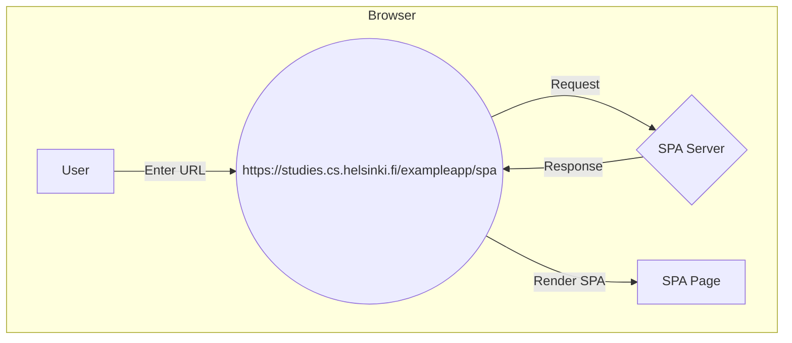

```mermaid
graph TD
    subgraph Browser
        A[User] -->|Enter URL| B((https://studies.cs.helsinki.fi/exampleapp/spa))
        B -->|Request| C{SPA Server}
        C -->|Response| B
        B -->|Render SPA| D[SPA Page]
    end
```
