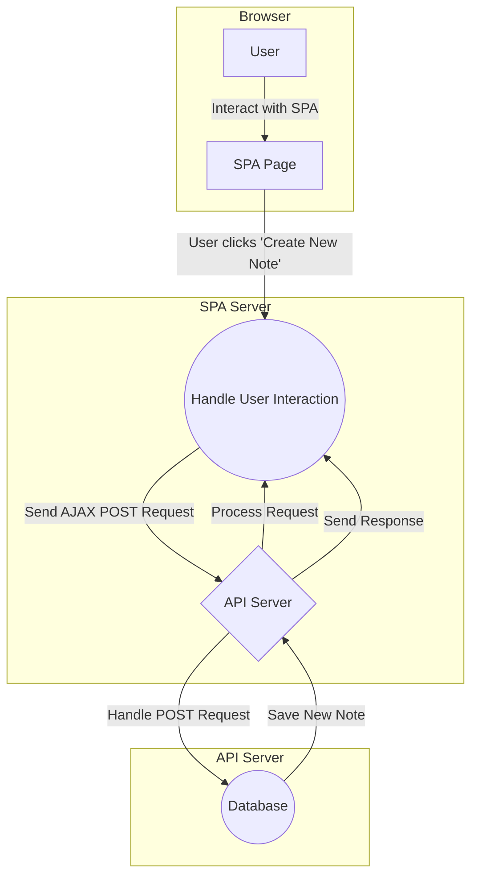

```mermaid
    graph TD
    subgraph Browser
        A[User] -->|Interact with SPA| B[SPA Page]
    end
    subgraph SPA Server
        B -->|User clicks 'Create New Note'| C((Handle User Interaction))
        C -->|Send AJAX POST Request| D{API Server}
        D -->|Process Request| C
        D -->|Send Response| C
    end
    subgraph API Server
        D -->|Handle POST Request| E((Database))
        E -->|Save New Note| D
    end

```